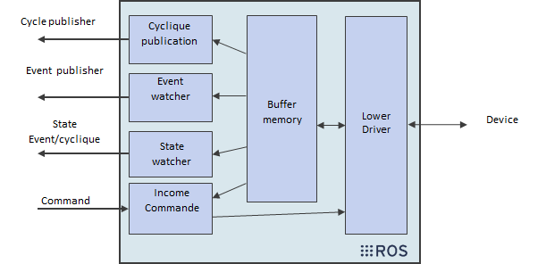

# Modbus_ROS2

## Overview

A ROS 2 package for Modbus with TCP

**Keywords:** ROS 2, Modbus, Modbus TCP

### License

The source code is released under a [MIT license](LICENSE).

## Installation

#### Dependencies

- [Robot Operating System (ROS) 2](http://wiki.ros.org) (middleware for robotics),
- [libyaml-cpp-dev](https://github.com/jbeder/yaml-cpp) ,
- [libmodbus-dev](https://github.com/stephane/libmodbus) (Modbus library)

#### Building

	cd ros2_workspace/src
	git clone -b main --recursive https://gitlab.univ-nantes.fr/CAPACITES-ROBOTIQUE_PROCEDES/module-ros/modbus_ros2.git
	cd ..
	colcon build --symlink-install --packages-select ros_modbus_msgs ros_modbus

## Node

#### Architecture

The package provides a C++ node: `ros2 run ros_modbus modbus_node`

While continuously updating the state of the Modbus device's IOs, the node may publish two types of messages:
- The IO's state (on timer or on event depending on the configuration file)
- The node state (indicating wether published data should be considered valid or not, and a debug code)

## Published Topics 

* **`state`** ([ros_modbus_msgs/State])

	Publishes the node state in a custom message, the state will be published on timer and on event:
	
		std_msgs/Header header            # header info
		bool state                        # Data validity
		uint8 error 					  # error number

* **`report_timer`** ([ros_modbus_msgs/Modbus])

	Publishes in a custom message the IO values on timer callback for IOs configured as such in the configuration file:
	
		std_msgs/Header header            # header info
		string[] in_out                   # name of each I/O
		uint16[] values                   # value of each I/O

* **`report_event`** ([ros_modbus_msgs/Modbus])

	Publishes in a custom message the IO values on event callback for IOs configured as such in the configuration file:
	
		std_msgs/Header header            # header info
		string[] in_out                   # name of each I/O
		uint16[] values                   # value of each I/O

## Subscribed Topics 

* **`command`** ([ros_modbus_msgs/Modbus])

	Subscribes to commands, write the received values on the associated outputs of the device:
	
		std_msgs/Header header            # header info
		string[] in_out                   # name of each I/O
		uint16[] values                   # value of each I/O

## Parameters

- `sub_queue_size`
    - Type: integer
    - Description: Queue size for subscribers
    - Default value: 10
- `pub_queue_size`
    - Type: integer
    - Description: Queue size for publisher
    - Default value: 5
- `name`
    - Type: string
    - Description: Name of the device, must be the same in the configuration file
    - Default value: test_device
- `YAML_config_file`
    - Type: string
    - Description: File containing the configuration to be loaded
    - Default value: FULL/PATH/TO/YOUR/config_file.yaml

## Configuration file

A configuration file example can be found in `ros_modbus/config` as `configuration.yaml`
